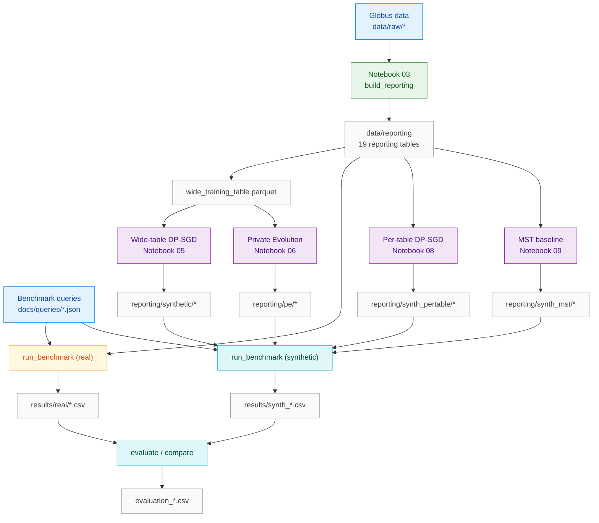

<div align="center">

# Training-based versus training-free differential privacy for data synthesis

[Mehak Kapur](https://github.com/mekapur), [Hana Tjendrawasi](https://github.com/hanajuliatj), [Jason Tran](https://github.com/jktrns), [Phuc Tran](https://github.com/21phuctran), Yu-Xiang Wang
`{mekapur,htjendrawasi,jat037,pct001,yuxiangw}@ucsd.edu`

</div>

### Abstract

Differentially private synthetic data generation promises to resolve the tension between data utility and individual privacy, enabling the release of datasets that preserve the statistical properties analysts need while bounding what any adversary can learn about a single record. Two paradigms have emerged to fulfill this promise. Training-based methods inject calibrated noise during model optimization, coupling privacy to the learning process itself. Training-free methods instead leverage foundation models through black-box API access, achieving privacy through selection mechanisms that never touch the model's parameters. Both have demonstrated success on image and text benchmarks, yet their behavior on realistic, multi-table relational data remains largely unexplored. We investigate both approaches on Intel's Driver and Client Applications (DCA) telemetry corpus, evaluating against a benchmark of 21 analytical SQL queries representative of production business intelligence workloads.

View the full report [here](report/q2-report.pdf).

---

## Setup

This project uses [uv](https://docs.astral.sh/uv/) for package management.

1. Install uv:

   ```bash
   # macOS/Linux
   curl -LsSf https://astral.sh/uv/install.sh | sh

   # Or with Homebrew
   brew install uv

   # Or with pip
   pip install uv
   ```

2. Create the virtual environment and install dependencies:

   ```bash
   uv venv
   uv sync
   ```

3. Activate the environment:

   ```bash
   source .venv/bin/activate
   ```

4. Register the Jupyter kernel (for notebooks):

   ```bash
   python -m ipykernel install --user --name dsc180-q2 --display-name "DSC 180B Q2"
   ```

5. For Private Evolution (notebook 06), create `.env` with your OpenAI API key:

   ```bash
   cp .env.example .env
   # Edit .env and set OPENAI_API_KEY=sk-...
   ```

6. For MST baseline (notebook 09), install smartnoise-synth separately:

   ```bash
   uv pip install smartnoise-synth==1.0.5
   ```

---

## Project structure

| Directory | Description | Details |
|---|---|---|
| [`src/`](src/README.md) | Library code: Private Evolution, evaluation framework, CLI pipeline stages, and additive experiment utilities. | Four packages (`pe/`, `eval/`, `pipeline/`, `experiments/`) used by notebooks 06-15 and standalone scripts. |
| [`data/`](data/README.md) | Raw telemetry, reporting tables, model checkpoints, and evaluation results. | ~32 GiB total, all gitignored except `README.md` and manifests. |
| [`tests/`](tests/README.md) | Unit tests for `src/` modules. | 46 tests; no data or API keys required. |
| [`scripts/`](scripts/README.md) | Standalone evaluation and report-data utilities. | `evaluate_pe.py` and `generate_report_data.py`. |
| `notebooks/` | Numbered workflow notebooks (01-15). | Data exploration, reporting table construction, four synthesis methods, cross-method evaluation, and additive follow-up experiments. |
| `docs/queries/` | 24 benchmark SQL queries in JSON format. | 21 feasible, 3 infeasible (stub data). |
| `report/` | LaTeX report source (XeLaTeX + BibTeX). | `q2-report.tex`, `q1-report.tex`, `q2-proposal.tex`, custom style file. |
| `dsc-180a-q1/` | Git submodule containing the Q1 DP-VAE implementation. | |

---

## Pipeline

Each pipeline stage can be run via the numbered notebooks (interactive) or the equivalent CLI commands. Both use the same `src/` library code. See [`src/README.md`](src/README.md) for detailed module documentation.



CLI equivalents:

```bash
uv run python -m src.pipeline.build_reporting --raw-dir data/raw --out-dir data/reporting
uv run python -m src.pipeline.run_benchmark --reporting-dir data/reporting --output-dir data/results/real
uv run python -m src.pipeline.run_benchmark --reporting-dir data/reporting/synth_pertable --output-dir data/results/synth_pertable
uv run python -m src.pipeline.evaluate --real-dir data/results/real --synth-dir data/results/synth_pertable --output data/results/evaluation_pertable.csv
uv run python -m src.pipeline.pe_postprocess --from-checkpoint data/pe_checkpoints
```

Notebooks 01-05 contain all logic inline. Notebooks 06-15 import from `src/` for shared evaluation, PE functionality, and additive follow-up utilities.

---

## Data

The DCA telemetry data (~20.7 GiB) is hosted on the HDSI Industry Data Repository and transferred via [Globus](https://www.globus.org/). See [`data/README.md`](data/README.md) for the complete download list, expected directory structure, and a table showing which pipeline stage produces which files.

---

## Tests

```bash
uv run pytest tests/ -v
```

46 tests covering privacy accounting, workload-aware distance, evaluation metrics, decomposition utilities, and SQL adaptation. Tests do not require downloaded data or API keys.
